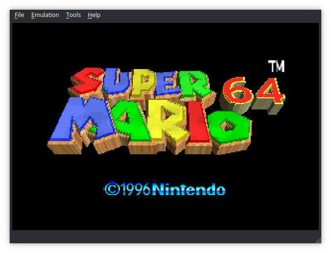

<!--  -->
<!-- 

 -->

 

----

A multi-system emulator

## Current systems
- Chip 8
- Gameboy / Gameboy Color
- NES
- Nintendo 64

## Building

You will need a C++20 compliant compiler like `gcc-12`

 
Archlinux

<pre><code>pacman -S --needed qt6
git clone https://github.com/OFFTKP/hydra.git
cd hydra
cmake -B build
cmake --build build --target hydra -j $(nproc)
</code></pre>

Ubuntu
 
<pre><code>sudo apt-get update
sudo apt-get install libgl-dev qt6-base-dev libqt6openglwidgets6 libqt6widgets6 libqt6opengl6 libqt6gui6
git clone https://github.com/OFFTKP/hydra.git
cd hydra
cmake -B build
cmake --build build --target hydra -j $(nproc)
</code></pre>

MacOS
 
You can replace <code>-j 4</code> with your actual number of cores
<pre><code>brew install qt6
cmake -B build
cmake --build build --target hydra -j 4
</code></pre>

Windows
 
Currently does not pass CI, so compilation might fail
Make sure to install Qt6 first
<pre><code>cmake.exe -B build -DCMAKE_TOOLCHAIN_FILE=C:/vcpkg/scripts/buildsystems/vcpkg.cmake
cmake.exe --build build --target hydra -j %NUMBER_OF_PROCESSORS%
</code></pre>

## Sister projects
[shadPS4](https://github.com/georgemoralis/shadPS4): Work-in-progress PS4 emulator by the founder of PCSX, PCSX2 and more    
[Panda3DS](https://github.com/wheremyfoodat/Panda3DS): A new, panda-themed, HLE Nintendo 3DS emulator

## Contributing
Any contribution is welcome. Fork, open an issue or work on existing ones, or work on improving the documentation

## License
hydra is licensed under the MIT license    
Copyright (C) 2021-2023 Paris Oplopoios

## Contributors

