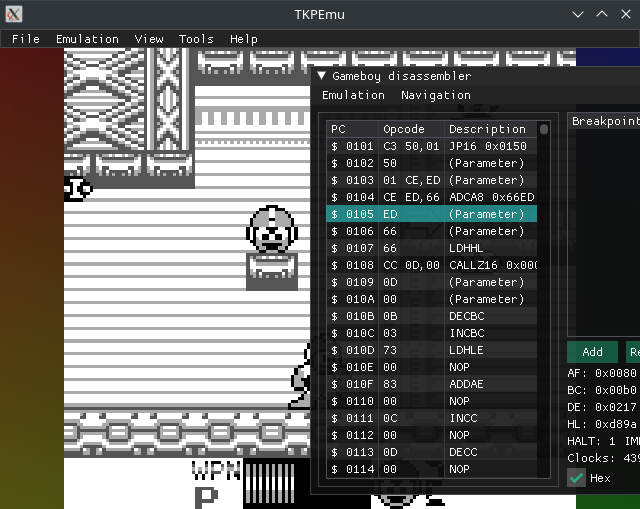

# TKPEmu
A multi-purpose, multi-platform emulator    
Using [Dear ImGui](https://github.com/ocornut/imgui) ([License](https://raw.githubusercontent.com/ocornut/imgui/master/LICENSE.txt))    

## Current emulators
- [Gameboy](https://github.com/OFFTKP/GameboyTKP)
## Dependencies 
Compiler: The `c++20` features used need at least `gcc-11` and `g++11` or latest `msvc`.   
Dependencies: `cmake git `    
Libraries: `sdl2 tbb boost`. See `Installation` for an easy installation guide

## Installation
CMake is going to download source files from [imgui](https://github.com/ocornut/imgui), [GameboyTKP](https://github.com/OFFTKP/GameboyTKP) and [glad-stable](https://github.com/OFFTKP/glad-stable)    
If you get an error while these files are being downloaded, check if the links above work, and open an issue

 
Archlinux, <a href="https://aur.archlinux.org/packages/tkpemu/">AUR</a>

 
Installation for Archlinux is very easy, just run the following command:    
<pre><code>yay -S tkpemu</code></pre> 
 Make sure you have <a href="https://github.com/Jguer/yay">yay</a> installed.    
Otherwise run the following:    
<pre><code>pacman -S --needed git base-devel
git clone --recurse-submodules -j8 https://aur.archlinux.org/tkpemu.git
cd tkpemu
makepkg -si</code></pre>

Ubuntu
 
These commands are used to install on a fresh ubuntu environment and some can be omitted.
<pre><code>sudo apt-get update
sudo apt-get install libsdl2-dev libtbb-dev libboost-all-dev build-essential gcc-11 g++-11
sudo update-alternatives --install /usr/bin/gcc gcc /usr/bin/gcc-11 100 --slave /usr/bin/g++ g++ /usr/bin/g++-11
sudo update-alternatives --set gcc /usr/bin/gcc-11
git clone --recurse-submodules -j8 https://github.com/OFFTKP/TKPEmu.git
cd TKPEmu
cmake -S TKPEmu -B TKPEmu/build
cmake --build TKPEmu/build
sudo mv ./TKPEmu/build/TKPEmu /usr/bin/TKPEmu
</code></pre>

Windows
 
Has not been tested. Follow similar procedure, clone with submodules, build with cmake.

## License
TKPEmu is licensed under the MIT license    
Copyright (C) 2021-2022 Paris Oplopoios

## Contributors

