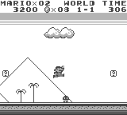
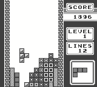

# GameboyTKP
Gameboy emulator written in C++ for [TKPEmu](https://github.com/OFFTKP/TKPEmu).
## Features
 - Customizable palette
 - Disassembler/Debugger with step/reset/pause functionality
 - Advanced breakpoints. You can create a breakpoint for a specific instruction with specific register values
 - Real time register values shown on disassembler
 - Trace logger
 - Save states (WIP)
 - Rewind functionality (WIP)
## Images

## Tests

See generated test results [here](./TEST_RESULTS.md).    
Always generate new test results before pushing a commit when changing the code.

-----
**[mattcurie](https://github.com/mattcurrie)'s tests:**
|Test|GameboyTKP  |
|--|--|
| dmg-acid2 | ❌ (Milestone [#1](https://github.com/OFFTKP/TKPEmu/milestone/1)) |

## License
See [TKPEmu](https://github.com/OFFTKP/TKPEmu) license
